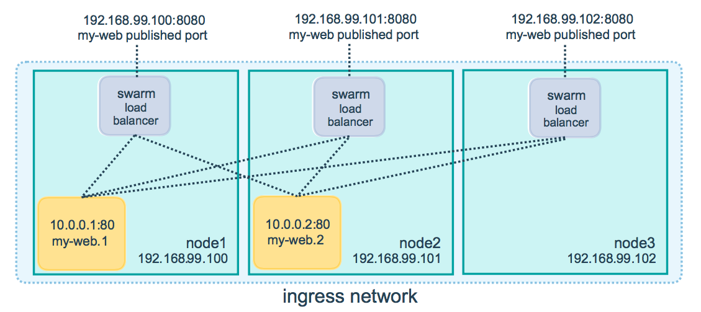

# Docker Swarm Tutorial


## Create the Swarm

```bash
docker swarm init
```

Run `docker info` to see the state of the swarm.

```bash
docker info
```

    ...
    Swarm: active
     NodeID: aey2almirdvyiccglnntnif1p
     Is Manager: true
     ClusterID: 6lour9p8nxjkt3o0c0zybc6z9
     Managers: 1
     Nodes: 1
     Orchestration:
      Task History Retention Limit: 5
     Raft:
     ...


Let's look at the nodes on this cluster, only expecting to see 1.

```bash
docker node ls
```

    ID                            HOSTNAME            STATUS              AVAILABILITY        MANAGER STATUS      ENGINE VERSION
    aey2almirdvyiccglnntnif1p *   lab2                Ready               Active              Leader              18.03.1-ce


## Deploy a Service to Swarm

After you create a swarm, you can deploy a service to the swarm.

```bash
docker service create --replicas 1 --name helloworld alpine ping docker.com
```

* The `docker service create` command creates the service.
* The `--name` flag names the service `helloworld`.
* The `--replicas` flag specifies the desired state of 1 running instance.
* The arguments `alpine ping docker.com` define the service as an Alpine Linux container that executes the command ping docker.com.

You can use docker service ls to see the running services on the swarm:
```bash
docker service ls
```

    ID                  NAME                MODE                REPLICAS            IMAGE               PORTS
    psxhu91jctcl        helloworld          replicated          1/1                 alpine:latest

## Inspect the Swarm Service

To display the details about a service in an easily readable format:

```bash
docker service inspect --pretty helloworld
```

    ID:		psxhu91jctclrtbwaowkail0z
    Name:		helloworld
    Service Mode:	Replicated
     Replicas:	1
    Placement:
    UpdateConfig:
     Parallelism:	1
     On failure:	pause
     Monitoring Period: 5s
     Max failure ratio: 0
     Update order:      stop-first
    RollbackConfig:
     Parallelism:	1
     On failure:	pause
     Monitoring Period: 5s
     Max failure ratio: 0
     Rollback order:    stop-first
    ContainerSpec:
     Image:		alpine:latest@sha256:7df6db5aa61ae9480f52f0b3a06a140ab98d427f86d8d5de0bedab9b8df6b1c0
     Args:		ping docker.com
    Resources:
    Endpoint Mode:	vip

Note: for json formatting, omit the `--pretty` flag.

To see which nodes are running the service:

```bash
docker service ps helloworld
```

    ID                  NAME                IMAGE               NODE                DESIRED STATE       CURRENT STATE           ERROR               PORTS
    pdhxshmnrc66        helloworld.1        alpine:latest       lab2                Running             Running 5 minutes ago

This is actually useful for multi-node clusters. By default, manager nodes in a swarm can execute tasks just like worker nodes. Swarm also shows you the DESIRED STATE and LAST STATE of the service task so you can see if tasks are running according to the service definition.

Note that we can also view what's happening at the container level

```bash
docker ps
```

    CONTAINER ID        IMAGE               COMMAND             CREATED             STATUS              PORTS               NAMES
    23cd91266795        alpine:latest       "ping docker.com"   13 minutes ago      Up 13 minutes                           helloworld.1.pdhxshmnrc66cgfbiyj9ayitv

## Scale a Service

Once you have deployed a service to a swarm, you are ready to use the Docker CLI to scale the number of containers in the service. Containers running in a service are called "tasks".

```bash
docker service scale helloworld=5
```

    helloworld scaled to 5
    overall progress: 5 out of 5 tasks
    1/5: running   [==================================================>]
    2/5: running   [==================================================>]
    3/5: running   [==================================================>]
    4/5: running   [==================================================>]
    5/5: running   [==================================================>]
    verify: Service converged

View the updated task list.
```bash
docker service ps helloworld
```

    ID                  NAME                IMAGE               NODE                DESIRED STATE       CURRENT STATE            ERROR               PORTS
    pdhxshmnrc66        helloworld.1        alpine:latest       lab2                Running             Running 34 minutes ago
    y25sp6z4llbs        helloworld.2        alpine:latest       lab2                Running             Running 35 seconds ago
    86h1ph7yrx8e        helloworld.3        alpine:latest       lab2                Running             Running 35 seconds ago
    dtaqaw50i0s6        helloworld.4        alpine:latest       lab2                Running             Running 35 seconds ago
    429e0rqsdkve        helloworld.5        alpine:latest       lab2                Running             Running 35 seconds ago

View the same container with `docker`

```bash
docker ps
```

    CONTAINER ID        IMAGE               COMMAND             CREATED              STATUS              PORTS               NAMES
    39bd953bc1fc        alpine:latest       "ping docker.com"   About a minute ago   Up About a minute                       helloworld.3.86h1ph7yrx8e54i4zspbw5as1
    6c1539a58062        alpine:latest       "ping docker.com"   About a minute ago   Up About a minute                       helloworld.4.dtaqaw50i0s6wqlnqk21pru7s
    7e9933ceebb2        alpine:latest       "ping docker.com"   About a minute ago   Up About a minute                       helloworld.5.429e0rqsdkve5hvdtqwikeg9b
    30cab0773e63        alpine:latest       "ping docker.com"   About a minute ago   Up About a minute                       helloworld.2.y25sp6z4llbsnen1w7k9e2l7w
    23cd91266795        alpine:latest       "ping docker.com"   34 minutes ago       Up 34 minutes                           helloworld.1.pdhxshmnrc66cgfbiyj9ayitv

## Delete a Service

We're done with this service. Let's delete it.

```bash
docker service rm helloworld
```

    helloworld

Verify the swarm manager removed the service

```bash
docker service inspect helloworld
```

    []
    Status: Error: no such service: helloworld, Code: 1


The service is immediately deleted, but the task containers take some time to cleanup. You can run `docker ps` to verify the containers have actually stopped

```bash
docker ps
```

    CONTAINER ID        IMAGE               COMMAND             CREATED             STATUS              PORTS               NAMES

## Apply a Rolling Update to a Service

In this part of the tutorial, you deploy a service based on the Redis 5.0.10 container image. Then you upgrade the service to use the Redis  6.0.9 container image using rolling updates.

Deploy Redis 5.0.10 to the swarm and configure the swarm with a 10 second update delay:

```bash
docker service create \
 --replicas 3 \
 --name redis \
 --update-delay 10s \
 redis:5.0.10
```

    rpgpsddazage2d6zp2vkk3t4w
    overall progress: 3 out of 3 tasks
    1/3: running   [==================================================>]
    2/3: running   [==================================================>]
    3/3: running   [==================================================>]
    verify: Service converged

You configure the rolling update policy at service deployment time.

The `--update-delay` flag configures the time delay between updates to a service task or sets of tasks. You can describe the time T as a combination of the number of seconds Ts, minutes Tm, or hours Th. So 10m30s indicates a 10 minute 30 second delay.

By default the scheduler updates 1 task at a time. You can pass the `--update-parallelism` flag to configure the maximum number of service tasks that the scheduler updates simultaneously.

By default, when an update to an individual task returns a state of `RUNNING`, the scheduler schedules another task to update until all tasks are updated. If, at any time during an update a task returns `FAILED`, the scheduler pauses the update. You can control the behavior using the `--update-failure-action` flag for `docker service create` or `docker service update`.

Inspect the redis service

```bash
docker service inspect --pretty redis
```

    ID:		rpgpsddazage2d6zp2vkk3t4w
    Name:		redis
    Service Mode:	Replicated
     Replicas:	3
    Placement:
    UpdateConfig:
     Parallelism:	1
     Delay:		10s
     On failure:	pause
     Monitoring Period: 5s
     Max failure ratio: 0
     Update order:      stop-first
    RollbackConfig:
     Parallelism:	1
     On failure:	pause
     Monitoring Period: 5s
     Max failure ratio: 0
     Rollback order:    stop-first
    ContainerSpec:
     Image:		redis:5.0.10@sha256:6a692a76c2081888b589e26e6ec835743119fe453d67ecf03df7de5b73d69842
    Resources:
    Endpoint Mode:	vip

Now you can update the container image for redis. The swarm manager applies the update to nodes according to the UpdateConfig policy:

```bash
docker service update --image redis:6.0.9 redis
```

    redis
    overall progress: 3 out of 3 tasks
    1/3: running   [==================================================>]
    2/3: running   [==================================================>]
    3/3: running   [==================================================>]
    verify: Service converged

The scheduler applies rolling updates as follows by default:

1. Stop the first task.
1. Schedule update for the stopped task.
1. Start the container for the updated task.
1. If the update to a task returns RUNNING, wait for the specified delay period then start the next task.
1. If, at any time during the update, a task returns FAILED, pause the update.


See the new image in the desired state:

```bash
docker service inspect --pretty redis
```

    ID:		rpgpsddazage2d6zp2vkk3t4w
    Name:		redis
    Service Mode:	Replicated
     Replicas:	3
    UpdateStatus:
     State:		completed
     Started:	About a minute ago
     Completed:	55 seconds ago
     Message:	update completed
    Placement:
    UpdateConfig:
     Parallelism:	1
     Delay:		10s
     On failure:	pause
     Monitoring Period: 5s
     Max failure ratio: 0
     Update order:      stop-first
    RollbackConfig:
     Parallelism:	1
     On failure:	pause
     Monitoring Period: 5s
     Max failure ratio: 0
     Rollback order:    stop-first
    ContainerSpec:
     Image:		redis:6.0.9@sha256:730b765df9fe96af414da64a2b67f3a5f70b8fd13a31e5096fee4807ed802e20
    Resources:
    Endpoint Mode:	vip


The output of service inspect shows if your update paused due to failure:

    ID:		rpgpsddazage2d6zp2vkk3t4w
    Name:		redis
    Service Mode:	Replicated
     Replicas:	3
    UpdateStatus:
     State:		paused
     Started:	4 seconds ago
     Message:	update paused due to failure or early termination of task leztm0o0ky46907paw6ebq3xz
    Placement:
    UpdateConfig:
     Parallelism:	1
     Delay:		10s
     On failure:	pause
     Monitoring Period: 5s
     Max failure ratio: 0
     Update order:      stop-first
    RollbackConfig:
     Parallelism:	1
     On failure:	pause
     Monitoring Period: 5s
     Max failure ratio: 0
     Rollback order:    stop-first
    ContainerSpec:
     Image:		redis:nowayjose
    Resources:
    Endpoint Mode:	vip


To restart a paused update run `docker service update <SERVICE-ID>`. For example: `docker service update redis`. To avoid repeating certain update failures, you may need to reconfigure the service by passing flags to `docker service update`.

View the rolling update:

```bash
docker service ps redis
```

    ID                  NAME                IMAGE               NODE                DESIRED STATE       CURRENT STATE             ERROR                              PORTS
    pvo1kzza9u0q        redis.1             redis:4             lab2                Running             Running 15 seconds ago
    vj4qyevwpcwl         \_ redis.1         redis:3.0.7         lab2                Shutdown            Shutdown 15 seconds ago
    paus9fnwvrej         \_ redis.1         redis:3.0.6         lab2                Shutdown            Shutdown 7 minutes ago
    vwvf4jbk5s4z        redis.2             redis:4.0.1         lab2                Running             Preparing 5 seconds ago
    p848gredanql         \_ redis.2         redis:4             lab2                Shutdown            Shutdown 3 seconds ago
    yte2xdjayi2v         \_ redis.2         redis:3.0.6         lab2                Shutdown            Shutdown 6 minutes ago
    rs5rfnuoutf3        redis.3             redis:4             lab2                Running             Running 37 seconds ago
    nor0r2b3xmes         \_ redis.3         redis:3.0.7         lab2                Shutdown            Shutdown 42 seconds ago
    y1dujtnzzwlc         \_ redis.3         redis:nowayjose     lab2                Shutdown            Rejected 4 minutes ago    "No such image: redis:nowayjose"
    wvl54wwlaute         \_ redis.3         redis:nowayjose     lab2                Shutdown            Rejected 4 minutes ago    "No such image: redis:nowayjose"
    wi11xcuoch6z         \_ redis.3         redis:nowayjose     lab2                Shutdown            Rejected 4 minutes ago    "No such image: redis:nowayjose"

## Drain a Swarm Node

In earlier steps of the tutorial, our node has been running with `ACTIVE` availability. The swarm manager can assign tasks to any `ACTIVE` node, so up to now our node has been available to receive tasks.

Sometimes, such as planned maintenance times, you need to set a node to `DRAIN` availability. `DRAIN` availability prevents a node from receiving new tasks from the swarm manager. It also means the manager stops tasks running on the node and launches replica tasks on a node with `ACTIVE` availability.

Important: Setting a node to `DRAIN` does not remove standalone containers from that node, such as those created with docker run, docker-compose up, or the Docker Engine API. A node’s status, including `DRAIN`, only affects the node’s ability to schedule swarm service workloads.

Verify the node is active

```bash
docker node ls
```

    ID                            HOSTNAME            STATUS              AVAILABILITY        MANAGER STATUS      ENGINE VERSION
    aey2almirdvyiccglnntnif1p *   lab2                Ready               Active              Leader              18.03.1-ce


Verify redis is still running in the current state.

```bash
docker service ps redis
```

    ID                  NAME                IMAGE               NODE                DESIRED STATE       CURRENT STATE             ERROR                              PORTS
    i7l7ih00bkds        redis.1             redis:4.0.1         lab2                Running             Running 3 minutes ago
    pvo1kzza9u0q         \_ redis.1         redis:4             lab2                Shutdown            Shutdown 3 minutes ago
    vj4qyevwpcwl         \_ redis.1         redis:3.0.7         lab2                Shutdown            Shutdown 3 minutes ago
    paus9fnwvrej         \_ redis.1         redis:3.0.6         lab2                Shutdown            Shutdown 10 minutes ago
    vwvf4jbk5s4z        redis.2             redis:4.0.1         lab2                Running             Running 3 minutes ago
    p848gredanql         \_ redis.2         redis:4             lab2                Shutdown            Shutdown 3 minutes ago
    yte2xdjayi2v         \_ redis.2         redis:3.0.6         lab2                Shutdown            Shutdown 10 minutes ago
    jevx7gauxa1z        redis.3             redis:4.0.1         lab2                Running             Running 2 minutes ago
    rs5rfnuoutf3         \_ redis.3         redis:4             lab2                Shutdown            Shutdown 2 minutes ago


Run docker node update --availability drain <NODE-ID> to drain a node. Remember to replace `lab2` with the name or ID of your node.

```bash
docker node update --availability drain lab2
```

    lab2

Inspect the node to check its availability. Be sure to use your own node name.

```bash
docker node inspect --pretty lab2
```

    ID:			aey2almirdvyiccglnntnif1p
    Hostname:              	lab2
    Joined at:             	2018-03-30 07:42:35.576741572 +0000 utc
    Status:
     State:			Ready
     Availability:         	Drain
     Address:		10.138.0.3
     ...

The drained node shows `Drain` for `Availability`.

See how the swarm manager updated the task assignments for the redis service.

```bash
docker service ps redis
```

    ID                  NAME                IMAGE               NODE                DESIRED STATE       CURRENT STATE             ERROR                              PORTS
    vqpguxprd9tl        redis.1             redis:4.0.1                             Running             Pending 2 minutes ago     "no suitable node (1 node not …"
    ...
    p22d7jvvvxpq        redis.2             redis:4.0.1                             Running             Pending 2 minutes ago     "no suitable node (1 node not …"
    ...
    m0gvokvbdc9d        redis.3             redis:4.0.1                             Running             Pending 2 minutes ago     "no suitable node (1 node not …"
    ...

The swarm manager maintains the desired state by ending the task on a node with `Drain` availability and creating a new task on a node with `Active` availability. If we had more available nodes in this cluster, the tasks would have been assigned to those nodes.


Return the drained node to an active state:
```bash
docker node update --availability active lab2
```

    lab2


Verify the service is running again

```bash
docker service ps redis
```

    ID                  NAME                IMAGE               NODE                DESIRED STATE       CURRENT STATE             ERROR                              PORTS
    vqpguxprd9tl        redis.1             redis:4.0.1         lab2                Running             Running 12 seconds ago
    ...
    p22d7jvvvxpq        redis.2             redis:4.0.1         lab2                Running             Running 12 seconds ago
    ...
    m0gvokvbdc9d        redis.3             redis:4.0.1         lab2                Running             Running 12 seconds ago
    ...

Inspect the node to see the updated state:


```bash
docker node inspect --pretty lab2
```

    ID:			aey2almirdvyiccglnntnif1p
    Hostname:              	lab2
    Joined at:             	2018-03-30 07:42:35.576741572 +0000 utc
    Status:
     State:			Ready
     Availability:         	Active
     Address:		10.138.0.3

 When you set the node back to Active availability, it can receive new tasks:

* during a service update to scale up
* during a rolling update
* when you set another node to Drain availability
* when a task fails on another active node

## Use Swarm Mode Routing Mesh

Docker Engine swarm mode makes it easy to publish ports for services to make them available to resources outside the swarm. All nodes participate in an ingress routing mesh. The routing mesh enables each node in the swarm to accept connections on published ports for any service running in the swarm, even if there’s no task running on the node. The routing mesh routes all incoming requests to published ports on available nodes to an active container.

To use the ingress network in the swarm, you need to have the following ports open between the swarm nodes before you enable swarm mode:

Port 7946 TCP/UDP for container network discovery.
Port 4789 UDP for the container ingress network.
You must also open the published port between the swarm nodes and any external resources, such as an external load balancer, that require access to the port.

For our lab, the firewall rules have already been properly configured so you don't need to worry about opening ports.

You can also bypass the routing mesh for a given service.


### Publish a Port for a Service

Use the `--publish` flag to publish a port when you create a service. `target` is used to specify the port inside the container, and `published` is used to specify the port to bind on the routing mesh. If you leave off the `published` port, a random high-numbered port is bound for each service task. You need to inspect the task to determine the port.

`published` is the port where the swarm makes the service available. If you omit it, a random high-numbered port is bound. `target` is the port where the container listens. This parameter is required.

For example, the following command publishes port 80 in the nginx container to port 8080 for any node in the swarm:

```bash
docker service create \
  --name my-web \
  --publish published=8080,target=80 \
  --replicas 2 \
  nginx
```

When you access port 8080 on any node, Docker routes your request to an active container. On the swarm nodes themselves, port 8080 may not actually be bound, but the routing mesh knows how to route the traffic and prevents any port conflicts from happening.

The routing mesh listens on the published port for any IP address assigned to the node. For externally routable IP addresses, the port is available from outside the host. For all other IP addresses the access is only available from within the host.



You can use this command to add a port for an existing service: `docker service update --publish-add published=<PUBLISHED-PORT>,target=<CONTAINER-PORT> <SERVICE>`

View a service's published ports:

```bash
docker service inspect --format="{{json .Endpoint.Spec.Ports}}" my-web
```

```json
[{"Protocol":"tcp","TargetPort":80,"PublishedPort":8080,"PublishMode":"ingress"}]
```

The output shows the <CONTAINER-PORT> (labeled TargetPort) from the containers and the <PUBLISHED-PORT> (labeled PublishedPort) where nodes listen for requests for the service.


### Publish a port for TCP only or UDP only

By default, when you publish a port, it is a TCP port. You can specifically publish a UDP port instead of or in addition to a TCP port. When you publish both TCP and UDP ports, If you omit the protocol specifier, the port is published as a TCP port. If you use the longer syntax (recommended for Docker 1.13 and higher), set the `protocol` key to either `tcp` or `udp`.

Note that these tasks won't actually start because there is no such image - it is just an example.

TCP ONLY

```bash
docker service create --name dns-cache \
  --publish published=53,target=53 \
  dns-cache
```

UDP ONLY

```bash
docker service create --name dns-cache \
  --publish published=53,target=53,protocol=udp \
  dns-cache
```

TCP AND UDP

```bash
docker service create --name dns-cache \
  --publish published=53,target=53 \
  --publish published=53,target=53,protocol=udp \
  dns-cache
```

### Bypass the Routing Mesh

You can bypass the routing mesh, so that when you access the bound port on a given node, you are always accessing the instance of the service running on that node. This is referred to as `host` mode. There are a few things to keep in mind.

* If you access a node which is not running a service task, the service does not listen on that port. It is possible that nothing is listening, or that a completely different application is listening.
* If you expect to run multiple service tasks on each node (such as when you have 5 nodes but run 10 replicas), you cannot specify a static target port. Either allow Docker to assign a random high-numbered port (by leaving off the `target`), or ensure that only a single instance of the service runs on a given node, by using a global service rather than a replicated one, or by using placement constraints.
* To bypass the routing mesh, you must use `--publish` for your service and set `mode` to `host`. If you omit the `mode` key or set it to `ingress`, the routing mesh is used. The following command creates a global service using `host` mode and bypassing the routing mesh.

```
docker service create --name dns-cache \
  --publish published=53,target=53,protocol=udp,mode=host \
  --mode global \
  dns-cache
```

### Configure an External Load Balancer

You can configure an external load balancer for swarm services, either in combination with the routing mesh or without using the routing mesh at all.

#### Using the Routing Mesh

You can configure an external load balancer to route requests to a swarm service. For example, you could configure [HAProxy](http://www.haproxy.org/) to balance requests to an nginx service published to port 8080.


In this case, port 8080 must be open between the load balancer and the nodes in the swarm. The swarm nodes can reside on a private network that is accessible to the proxy server, but that is not publicly accessible.

You can configure the load balancer to balance requests between every node in the swarm even if there are no tasks scheduled on the node. For example, you could have the following HAProxy configuration in `/etc/haproxy/haproxy.cfg`:

```
global
        log /dev/log    local0
        log /dev/log    local1 notice
...snip...

# Configure HAProxy to listen on port 80
frontend http_front
   bind *:80
   stats uri /haproxy?stats
   default_backend http_back

# Configure HAProxy to route requests to swarm nodes on port 8080
backend http_back
   balance roundrobin
   server node1 192.168.99.100:8080 check
   server node2 192.168.99.101:8080 check
   server node3 192.168.99.102:8080 check
```

When you access the HAProxy load balancer on port 80, it forwards requests to nodes in the swarm. The swarm routing mesh routes the request to an active task. If, for any reason the swarm scheduler dispatches tasks to different nodes, you don’t need to reconfigure the load balancer.

You can configure any type of load balancer to route requests to swarm nodes.

#### Without the Routing Mesh

To use an external load balancer without the routing mesh, set `--endpoint-mode` to `dnsrr` instead of the default value of `vip`. In this case, there is not a single virtual IP. Instead, Docker sets up DNS entries for the service such that a DNS query for the service name returns a list of IP addresses, and the client connects directly to one of these. You are responsible for providing the list of IP addresses and ports to your load balancer.
